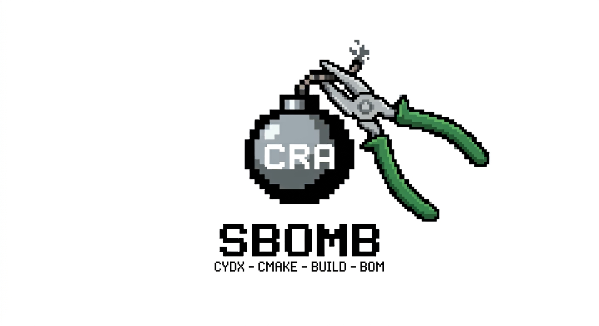

# sbomb

**An evidence-based SBOM generator that reconstructs the software composition
of CMake build artifacts.** It follows the build's own evidence backwards from
the final artifact instead of inferring it from the source tree, and writes
what it finds as CycloneDX 1.6, or 1.7 when a consumer asks for it.

The chain runs from a firmware image, an executable or a library through link
inputs, archive members, object files, translation units, sources, headers and
generated files. A file appears in the SBOM when there is a chain of evidence
connecting it to that artifact, and not otherwise.

That is the whole idea, and it is what makes the output usable for compliance
work under the EU Cyber Resilience Act and BSI TR-03183-2, where the question
is not *what is in the repository* but *what did you ship*.

## What makes it different

A repository scanner reports your tests, your examples, all forty drivers in
the vendored SDK and the package-manager cache. Your firmware contains a
fraction of that. sbomb describes the fraction.

Concretely:

- A static library on the link line contributes **only the members the linker
  actually extracted**, read from the linker map.
- A header contributes only if the compiler actually read it. sbomb prefers the
  DWARF line table over dependency files, because a dependency file lists
  headers an `#ifdef` skipped — being generous is right for rebuild triggers
  and wrong for a bill of materials.
- Nothing is inferred from a filename, a directory name or a repository URL.
  What cannot be established is reported as a finding and stays visible in the
  document.

[docs/architecture.md](docs/architecture.md) explains the machinery: the
evidence chain, the strategies behind each step, and where sbomb refuses to
guess.

## Relation to Syft and similar tools

[Syft](https://anchore.com/syft/) and its kin describe **packages**: they read
package metadata out of an image or a filesystem and are very good at it. Use
them for the container your application ships in.

sbomb describes **one compiled artifact**, from the build's own evidence. That
matters where package metadata does not exist — a vendored SDK, a git
submodule, a `FetchContent` dependency are just directories — and where
package granularity is too coarse: only the linker map knows that eleven of
`libcrypto.a`'s four hundred object files reached your firmware.

They are complementary, not alternatives. On a Linux product you will likely
want both.

## Requirements

A CMake project built with **Ninja**, **Ninja Multi-Config** or **Unix
Makefiles**, configured with `CMAKE_EXPORT_COMPILE_COMMANDS=ON`. GCC and Clang
are supported, including cross-compilation to bare-metal ARM and to Windows
through mingw-w64.

sbomb itself is a single static executable with no runtime dependencies, and it
never accesses the network.

## Install

```bash
curl -fsSL https://andste82.github.io/sbomb/install.sh | sh
```

Windows, in PowerShell:

```powershell
irm https://andste82.github.io/sbomb/install.ps1 | iex
```

The latest release, for your platform. A particular one:

```bash
curl -fsSL https://andste82.github.io/sbomb/install.sh | sh -s -- --version v0.11.0
```

Both scripts verify the download against the release's `SHA256SUMS` before
installing it, and neither offers a way to skip that — a tool whose argument is
that you should be able to check what you were given has no business handing
you a binary it did not check itself. `--with-sbom` installs the release's own
CycloneDX document beside the binary.

They are short and worth reading before you pipe them anywhere:
[install.sh](install.sh), [install.ps1](install.ps1). What the site serves is
published from this tree by a workflow, so the two cannot drift.

Or take the binary and its checksum straight from the
[releases page](https://github.com/Andste82/sbomb/releases).

For a CMake project that would rather fetch sbomb than have everyone install
it, the release ships a CMake bundle — one declaration gives you the module and
a matching binary:

```cmake
include(FetchContent)
FetchContent_Declare(sbomb
  URL https://github.com/Andste82/sbomb/releases/download/v0.11.0/sbomb-cmake.tar.gz)
FetchContent_MakeAvailable(sbomb)

sbomb_enable(TARGET app POLICY lenient)
```

The binary is fetched for the machine running the build, checked against
`SHA256SUMS`, and pinned by the URL. See
[docs/getting-started.md](docs/getting-started.md).

## Quick start

```bash
# 1. Build with the evidence sbomb needs
cmake -S . -B build -DCMAKE_EXPORT_COMPILE_COMMANDS=ON \
      -DCMAKE_EXE_LINKER_FLAGS="-Wl,-Map=build/app.map"
cmake --build build

# 2. Describe what you built
sbomb generate --build-dir build --output build/app.cdx.json
```

The linker map is what lets sbomb see inside static archives. The bundled CMake
module adds the right flags for you — see
[docs/getting-started.md](docs/getting-started.md).

## Commands

| Command | Purpose |
|---|---|
| `sbomb generate` | Produce the SBOM and evaluate policy |
| `sbomb explain` | Show why a file or component is in the SBOM |
| `sbomb validate` | Check an existing CycloneDX document |
| `sbomb evidence` | Dump the evidence graph without writing an SBOM |
| `sbomb self` | Describe a Go binary from the record its linker embedded |
| `sbomb schema` | Print the embedded configuration or CycloneDX schema |
| `sbomb version` | Print the tool version |

### generate

```bash
sbomb generate \
  --build-dir build/debug \
  --config sbomb.json \
  --output build/debug/app.cdx.json \
  --review-report build/debug/review.txt \
  --policy cra
```

`--build-dir` is the only required flag; `sbomb.json` is picked up
automatically when it is present.

Alongside the SBOM the run writes `evidence.json` into the build directory: the
complete graph, every edge with its strength, its confidence and where it came
from. `sbomb explain` reads it from there. `--evidence-dump` moves it, and
`--evidence-dump=off` leaves the build directory untouched.

### explain

```bash
sbomb explain --build-dir build/debug --file project:src/main.c
sbomb explain --build-dir build/debug --component mbedtls
sbomb explain --build-dir build/debug --bom-ref file:project:src/main.c
```

Prints the evidence chains from the selected item back to the deliverable. This
is the answer to "why is this here?" — and, when it prints nothing, to "why is
this *not* here?".

### validate

```bash
sbomb validate --input build/debug/app.cdx.json
```

Runs both layers: the official CycloneDX JSON Schema, and the semantic checks a
schema cannot express — a closed dependency graph, unique references, well-formed
purls.

### self

```bash
sbomb self dist/sbomb-linux-amd64 --output dist/sbomb-linux-amd64.cdx.json \
  --version 1.2.3 --module-dir . --goroot "$(go env GOROOT)" --reproducible
```

Describes a Go executable from the module record its linker embedded: every
module linked in, at the version and with the `go.sum` hash that reached the
artifact. It reads the binary and nothing else — no subprocess, no network, no
source tree — so it also works on a cross-compiled binary for a platform the
host cannot run. Every sbomb release ships the SBOM of itself beside each
binary, produced this way.

## Flags

**Where things are**

| Flag | Meaning |
|---|---|
| `--build-dir <dir>` | The CMake build directory. Required. |
| `--config <file>` | Configuration file; defaults to `sbomb.json` if present |
| `--output <file>` | Where to write the SBOM |
| `--source-dir <dir>` | Source root, overriding `project.root` |
| `--mode single\|assembly` | One deliverable, or several treated as one product |
| `--config-name <name>` | Which configuration to read from a multi-config generator |
| `--map <file>` | Linker map, when it is not beside the artifact |
| `--link-depfile <file>` | Link dependency file, when it is not beside the artifact |
| `--image-manifest <file>` | An extra packaging manifest; repeatable |

**What comes out**

| Flag | Meaning |
|---|---|
| `--findings-json <file>` | Machine-readable diagnostics |
| `--review-report <file>` | Human-readable review report |
| `--report-format text\|markdown` | Report rendering; default `text` |
| `--report-chains all` | Include the full evidence chains in the report |
| `--evidence-dump <path>` | Where the evidence graph goes; `off` writes none |
| `--format cyclonedx-json` | Output format; the only one so far |
| `--spec-version 1.6\|1.7` | CycloneDX revision; default `1.6` |
| `--reproducible` | Omit the timestamp and derive a stable serial number |

**Policy**

| Flag | Meaning |
|---|---|
| `--policy lenient\|default\|cra\|strict` | Profile; default `default` |
| `--profile-overlay host-linux` | Report distribution libraries as components |
| `--header-evidence dwarf-preferred\|union\|depfiles` | Which header evidence governs |
| `--waivers <file>` | Waivers, each with a reason and an expiry |
| `--fail-on-<gate>[=false]` | Turn one gate on or off, whatever the profile says |
| `--include-<scope>[=false]` | Turn one scope option on or off |
| `--system-libraries=`, `--pch-headers=`, `--section-garbage-collection=`, `--include-toolchain-runtime=` | Scope options taking a value, e.g. `--system-libraries=separate-component` |

**Paths and limits**

| Flag | Meaning |
|---|---|
| `--path-flavor posix\|windows` | Path comparison rules; defaults to the host's |
| `--redact-unanchored-paths` | Replace paths outside every anchor with a digest |
| `--strict-symlinks` | Refuse a path whose final component is a symbolic link |
| `--max-input-size=<size>` | Input ceiling, e.g. `2G`, `512M`; default 2 GiB |
| `--allow-introspection[=groups]` | Permit the fixed subprocess allowlist; off by default |
| `-v`, `-vv`, `-vvv` | Verbosity |

## Exit codes

| Code | Meaning |
|---|---|
| 0 | SBOM written, policy passed |
| 1 | Usage or configuration error |
| 2 | Evidence could not be collected |
| 3 | Policy failed |
| 4 | CycloneDX validation failed |

Exit code 3 still writes the SBOM. It means the document was produced and
something in it needs a person.

## Configuration

Everything works without a configuration file. You need one to name the
deliverable explicitly, to curate component metadata, or to give external
directories a portable identity:

```json
{
  "project": {
    "name": "example-firmware",
    "version": "1.4.2",
    "supplier": "Example Org",
    "type": "firmware",
    "root": "."
  },
  "build": {"dir": "build/debug"},
  "artifacts": [{"path": "build/debug/firmware.elf", "role": "application"}],
  "components": [
    {
      "path": "dep/mbedtls",
      "name": "mbedtls",
      "version": "3.5.0",
      "supplier": "Trusted Firmware",
      "license": "Apache-2.0"
    }
  ],
  "policy": {"profile": "cra"}
}
```

Unknown keys are an error at every level of the file, so a typo cannot
silently disable a policy gate.
[docs/configuration.md](docs/configuration.md) covers every section.

## Documentation

| Document | Contents |
|---|---|
| [Getting started](docs/getting-started.md) | First run, CMake integration, what to build with |
| [Architecture](docs/architecture.md) | How the evidence chain works and what backs each step |
| [Configuration](docs/configuration.md) | The JSON file, anchors, components, policy |
| [Findings](docs/findings.md) | Every diagnostic identifier and what it means |
| [Properties](docs/properties.md) | The `sbomb:` properties a document carries |
| [CI](docs/ci.md) | The GitHub Action and the release workflow |
| [Windows](docs/windows.md) | Notes for Windows hosts |

The normative specification, the recorded deviations from it and the
development notes are under [docs/dev](docs/dev/).

## License

sbomb is distributed under the MIT license; see [LICENSE](LICENSE).

It has three third-party Go dependencies, all under permissive licenses
compatible with MIT, which is why `vendor/` is committed and redistributed with
the source; what each one is for is recorded in
[docs/dev/dependencies.md](docs/dev/dependencies.md). The SPDX licence data
`internal/license` matches against consists of digests and templates from the
official SPDX list, regenerated by `tools/spdxgen`.
