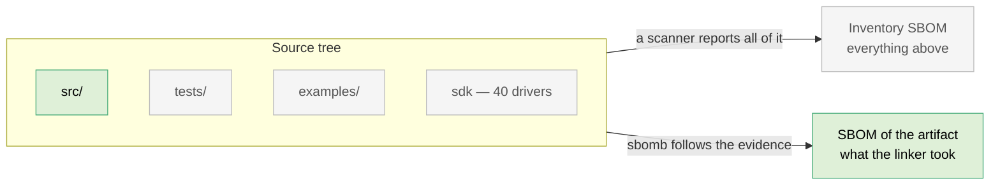
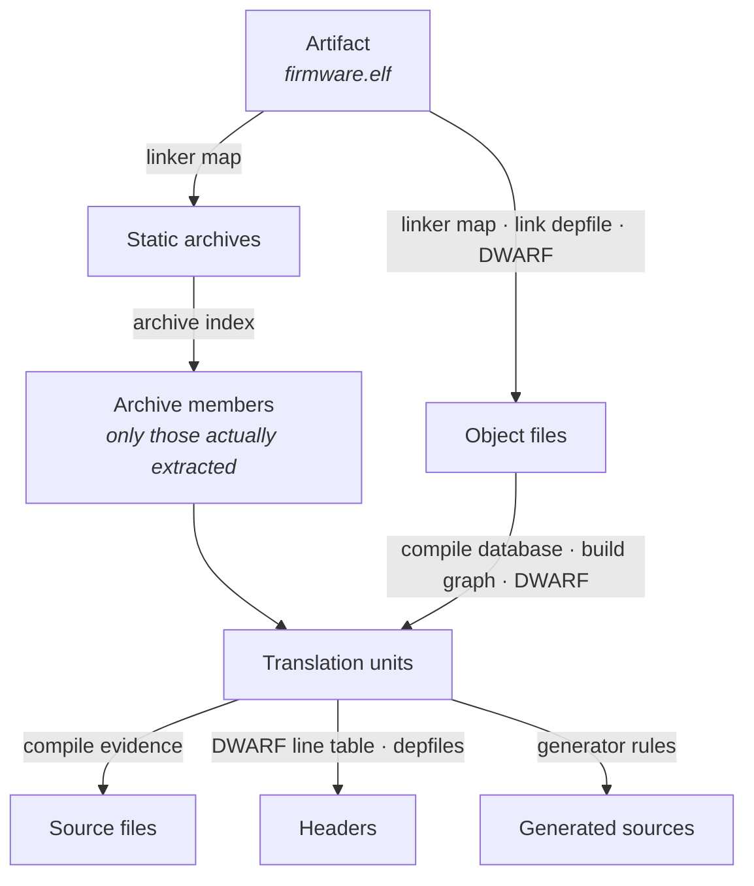
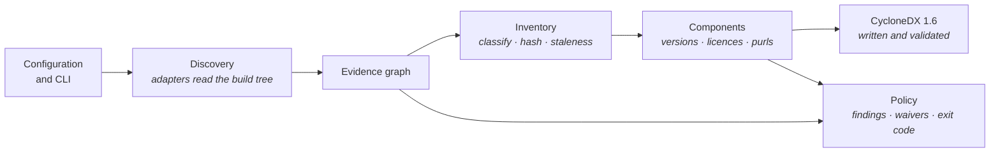
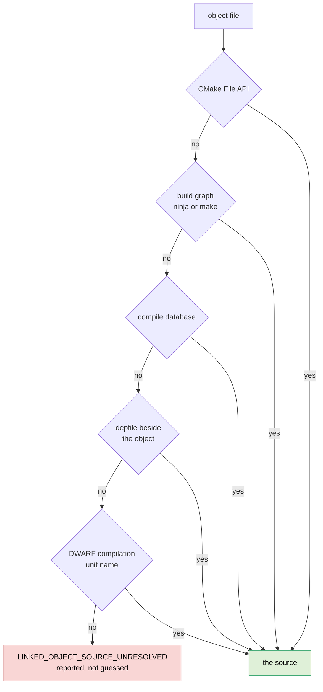
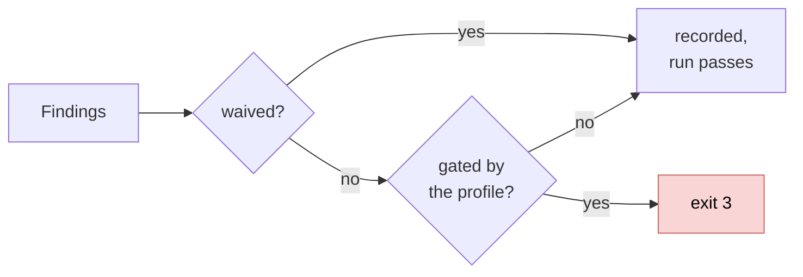

# How sbomb works

sbomb answers one question:

> Which files and components demonstrably reached *this* build artifact?

Everything else follows from that. This document explains the machinery — what
evidence sbomb reads, how it turns that into a chain, and where it refuses to
guess. It is written for someone who has to trust the output, not for someone
editing the code.

## The rule everything rests on

A file enters the SBOM only if there is an unbroken chain of evidence from it to
a final deliverable. Presence on disk is not evidence. Neither is a plausible
name, a nearby directory, or a mention in a manifest.

That single rule is why sbomb produces a different — usually much smaller —
answer than a repository scanner. Your source tree contains tests, examples,
vendored SDKs, three architectures' worth of drivers and a package-manager
cache. Your firmware image contains a fraction of it. sbomb describes the
image.



## The chain

The chain runs backwards from the deliverable. Each step is a different kind of
evidence, produced by a different part of the build, read by a different
adapter.



The distinction that does the most work is **archives**. A static library on
the link line contributes only the members the linker actually pulled in. A
scanner reports the whole library; sbomb reports the members named in the map.

## The stages of a run



Discovery is the only stage that touches the build tree. Everything after it
works on the graph, which is why the same evidence always produces the same
document.

## What sbomb reads

| Source | What it settles |
|---|---|
| CMake File API | Targets, artifacts, source lists, toolchain and sysroot locations |
| `compile_commands.json` | Which source produced which object, and with which flags |
| Linker map (`-Wl,-Map=`) | What the linker put into the artifact, including archive members |
| Link dependency file (`-Wl,--dependency-file=`) | The link inputs, as the linker itself listed them |
| DWARF debug information | The translation units in the binary, and the headers each one used |
| `build.ninja` / `.ninja_deps` | Object↔source edges and the headers each compile read |
| Makefiles (`build.make`, `*.o.d`) | The same, for the Makefiles generator |
| Response files | Link and compile lines too long for a command line |
| Package manifests | Component identity for vcpkg, Conan, FetchContent, git submodules |

Two of these are not there unless you ask for them. The linker map and the link
dependency file are produced by linker flags, which is what `cmake/Sbomb.cmake`
adds. Without them sbomb falls back to DWARF, and without that it says so.

## Resolving an object to its source

There is never one way to learn which source produced `main.c.o`, and the
tempting way — matching basenames — is wrong. Two targets routinely compile
different files with the same name. sbomb tries the authoritative sources
first and stops at the first that gives exactly one answer:



When two strategies disagree, the higher-priority one wins and the
disagreement is reported rather than hidden.

## Headers

Headers are where most SBOM tools quietly overstate. An `#include` that the
preprocessor skipped inside an `#ifdef` did not contribute anything, and a
dependency file lists it anyway, because a dependency file exists to trigger
rebuilds — being generous is correct for that job and wrong for this one.

sbomb prefers the **DWARF line table**, which lists the files that actually
emitted code or declarations into the compilation unit. Dependency files are
the fallback for translation units with no debug information. Which of the two
governs is a policy choice:

| `--header-evidence` | Behaviour |
|---|---|
| `dwarf-preferred` *(default)* | DWARF where available, dependency files elsewhere |
| `union` | Everything either source names — the conservative reading |
| `depfiles` | Dependency files only |

Every header is then classified into exactly one class — project, third party,
SDK, generated, compiler runtime, system, or unknown — because a compliance
document treats a vendored crypto header differently from `stddef.h`. The
classification uses the include directories the toolchain itself reports, not a
hardcoded list of paths, and what each class does is a policy setting.

## Identity: anchors

An SBOM full of `/home/jenkins/workspace/build-472/src/main.c` is neither
portable nor comparable between two machines. Every file identity in sbomb is
an **anchor plus a relative path**:

```
project:src/main.c
build:generated/version.h
sdk:espidf:components/esp_wifi/src/wifi.c
pkg:conan/mbedtls:include/mbedtls/aes.h
```

The project root, build root, toolchain and sysroot are anchored automatically
from what the build itself reports. Anything else is anchored in the
configuration. A file under no anchor keeps its absolute path, is reported as
`UNANCHORED_FILE`, and can be replaced by a digest with
`--redact-unanchored-paths` — the same substitution in the SBOM, the findings
and the review report.

Anchoring is also what makes the output reproducible across machines: two
builds of the same commit in different directories produce byte-identical
documents.

## Confidence

Not every edge is equally strong, and the document says which is which. Two
things decide it: how direct the evidence is, and what kind of source it came
from.

| Strength | Structured, authoritative | Structured, secondary | Textual fallback |
|---|---|---|---|
| **direct** — the source states it outright | high | high | medium |
| **linked** — the linker recorded it | high | medium | low |
| **derived** — read off a mapping | high | medium | low |
| **packaged** — a package manager recorded it | high | medium | low |
| **generated** — produced by a build rule | medium | medium | low |
| **weak** — a last-resort strategy | low | low | low |

A linker map is authoritative about linking; a build log is a textual fallback.
Confidence is then **downgraded** for things that genuinely blur attribution:
link-time optimization, section garbage collection, a unity build that fuses
several sources into one translation unit. Each downgrade is recorded with its
reason, so a low-confidence edge always says why.

## Components and licences

Files are grouped into components in a fixed priority order: curated
configuration first, then package-manager metadata, then the nearest directory
carrying a package manifest, then the anchor root — and finally an explicit
`unknown:` component flagged for review. **A file is never dropped because its
component could not be determined.**

Versions, suppliers and purls come only from authorized sources. A version is
never inferred from a directory name; a supplier is never derived from a
repository URL. What cannot be established is reported as missing.

Licences are detected in four ways, in this order:

1. An `SPDX-License-Identifier:` in the file.
2. An exact digest match against the official SPDX licence texts.
3. The same after normalization — lowercase, collapsed whitespace, copyright
   lines removed.
4. A match against the SPDX **licence template**, which declares which spans of
   a licence may vary and what into. This is what recognizes a BSD licence
   whose copyright holder has been filled in and whose clauses were bulleted
   instead of numbered — unmistakable to a person, invisible to a digest.

None of these is a similarity score, and similarity matching is forbidden. When
a file contains *two* complete licence texts, sbomb records both as
`evidence.licenses` and leaves the component's licence NOASSERTION: which
licences are present is provable, whether both apply or you may choose is
written in the prose between them.

## Policy

Policy never changes *what* is discovered by way of a verdict. It has two
separable halves:

- **Scope** decides what belongs in the document — system headers, toolchain
  runtime, linker scripts, assets. Two profiles with the same scope produce the
  same document.
- **Gates** decide whether the run passes. Missing hashes, unknown licences,
  stale build artifacts, review-required components.

Four profiles ship: `lenient`, `default`, `cra` and `strict`. Every individual
gate can be overridden from the command line, and any finding can be waived in
a file with a reason and an expiry.



## What comes out

| Output | Contents |
|---|---|
| `<name>.cdx.json` | The CycloneDX 1.6 document. Validated against the official schema *and* semantically before it is written |
| `evidence.json` | The full evidence graph — every node, every edge, its strength, confidence and source |
| Findings JSON | Machine-readable diagnostics, with severity, subject and remediation |
| Review report | The same for a human, with the evidence chains behind the answers |

`sbomb explain` answers the reverse question for one file or component: *why is
this in my SBOM?* It prints the chains back to the deliverable.

## Boundaries sbomb keeps

These are deliberate, and they are what the answer is worth.

- **No network.** Ever. Not for licences, not for package metadata.
- **No shell.** Commands are never assembled as strings. A small, fixed
  allowlist of subprocesses exists behind `--allow-introspection`, off by
  default; nothing outside it can run.
- **No source-tree scanning.** A directory walk is not evidence.
- **No guessing.** Missing information becomes a finding. A file whose
  component, version or licence cannot be established is reported as such and
  stays in the document.
- **Bounded parsing.** Build metadata comes from somebody else's build tree and
  is treated as untrusted: line lengths, token counts, input sizes and
  recursion depth are all capped, archive paths are checked for traversal, and
  `--strict-symlinks` refuses to follow a link out of an anchor.
- **Deterministic output.** The same evidence yields the same bytes, on Linux,
  Windows and macOS.

## Where to go next

- [Getting started](getting-started.md) — first run, and the CMake integration.
- [Configuration](configuration.md) — the JSON file, anchors, components,
  policy.
- [Findings](findings.md) — every diagnostic identifier and what it means.
- [CI](ci.md) — the GitHub Action and the workflows.
