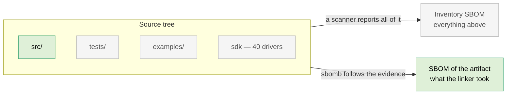
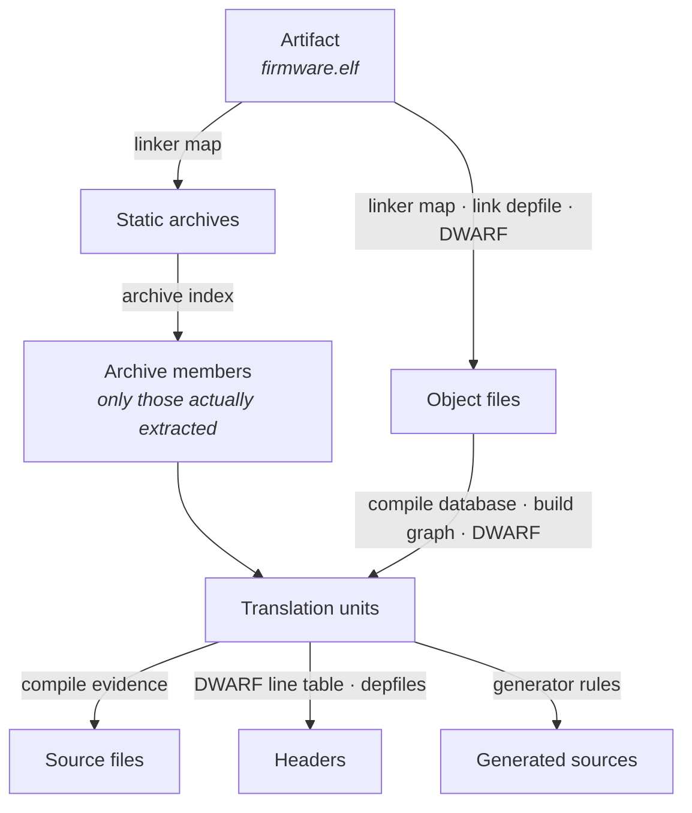
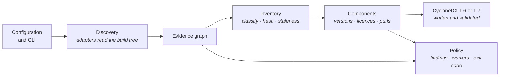
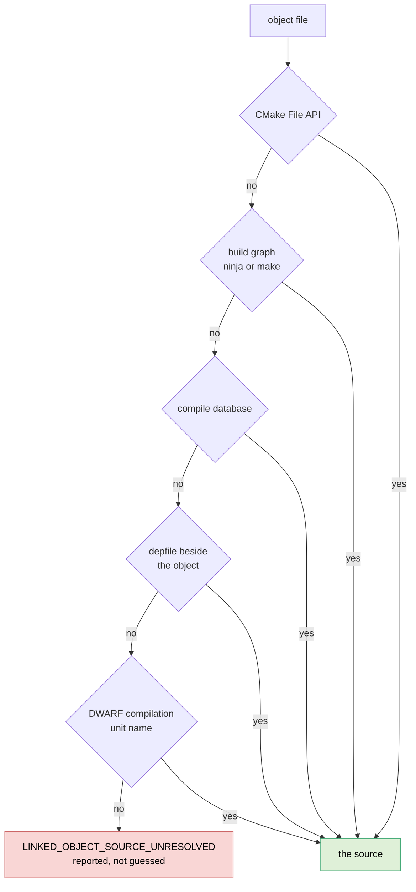
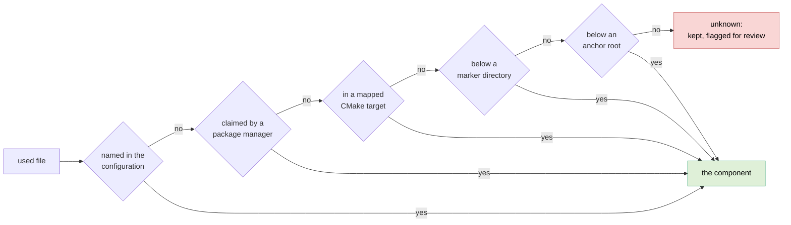
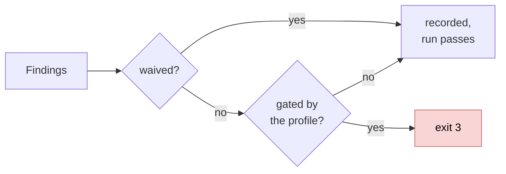

# How sbomb works

sbomb answers one question:

> Which files and components demonstrably reached *this* build artifact?

Everything else follows from that. This document explains the machinery — what
evidence sbomb reads, how it turns that into a chain, and where it refuses to
guess. It is written for someone who has to trust the output, not for someone
editing the code.

## The rule everything rests on

A file enters the SBOM only if there is an unbroken chain of evidence from it to
a final deliverable. Presence on disk is not evidence. Neither is a plausible
name, a nearby directory, or a mention in a manifest.

That single rule is why sbomb produces a different — usually much smaller —
answer than a repository scanner. Your source tree contains tests, examples,
vendored SDKs, three architectures' worth of drivers and a package-manager
cache. Your firmware image contains a fraction of it. sbomb describes the
image.



## The chain

The chain runs backwards from the deliverable. Each step is a different kind of
evidence, produced by a different part of the build, read by a different
adapter.



The distinction that does the most work is **archives**. A static library on
the link line contributes only the members the linker actually pulled in. A
scanner reports the whole library; sbomb reports the members named in the map.

## The stages of a run



Discovery is the only stage that reads build metadata. Later stages still touch
the tree — inventory hashes the files that survived and checks whether the build
is stale, and component mapping looks for a manifest or licence file at a
component's root — but none of them adds anything to the graph. What belongs in
the document was settled before they ran, which is why the same evidence always
produces the same document.

## What sbomb reads

| Source | What it settles |
|---|---|
| CMake File API | Targets, artifacts, source lists, toolchain and sysroot locations |
| `compile_commands.json` | Which source produced which object, and with which flags |
| Linker map (`-Wl,-Map=`) | What the linker put into the artifact, including archive members |
| Link dependency file (`-Wl,--dependency-file=`) | The link inputs, as the linker itself listed them |
| DWARF debug information | The translation units in the binary, and the headers each one used |
| `build.ninja` / `.ninja_deps` | Object↔source edges and the headers each compile read |
| Makefiles (`build.make`, `*.o.d`) | The same, for the Makefiles generator |
| Response files | Link and compile lines too long for a command line |
| Package manifests | Component identity for vcpkg, Conan, FetchContent, git submodules |
| Package file lists | Which installed files belong to which package, where the manager wrote it down |

Two of these are not there unless you ask for them. The linker map and the link
dependency file are produced by linker flags, which is what the CMake
integration adds. Name one and leave it missing and the run fails: describing a
different file than the one you named would be worse than stopping. Name
neither and sbomb falls back to DWARF, and without that it says so.

## Resolving an object to its source

There is never one way to learn which source produced `main.c.o`, and the
tempting way — matching basenames — is wrong. Two targets routinely compile
different files with the same name. sbomb tries the authoritative sources
first and stops at the first that gives exactly one answer:



When two strategies disagree, the higher-priority one wins and the
disagreement is reported rather than hidden.

## Headers

Headers are where most SBOM tools quietly overstate. An `#include` that the
preprocessor skipped inside an `#ifdef` did not contribute anything, and a
dependency file lists it anyway, because a dependency file exists to trigger
rebuilds — being generous is correct for that job and wrong for this one.

sbomb prefers the **DWARF line table**, which lists the files that actually
emitted code or declarations into the compilation unit. Dependency files are
the fallback for translation units with no debug information. Which of the two
governs is a policy choice:

| `--header-evidence` | Behaviour |
|---|---|
| `dwarf-preferred` *(default)* | DWARF where available, dependency files elsewhere |
| `union` | Everything either source names — the conservative reading |
| `depfiles` | Dependency files only |

Every header is then classified into exactly one class — project, third party,
SDK, generated, compiler runtime, system, or unknown — because a compliance
document treats a vendored crypto header differently from `stddef.h`. The
classification uses the include directories the toolchain itself reports, not a
hardcoded list of paths, and what each class does is a policy setting.

## Identity: anchors

An SBOM full of `/home/jenkins/workspace/build-472/src/main.c` is neither
portable nor comparable between two machines. Every file identity in sbomb is
an **anchor plus a relative path**:

```
project:src/main.c
build:generated/version.h
sdk:espidf:components/esp_wifi/src/wifi.c
pkg:conan/mbedtls:include/mbedtls/aes.h
```

The project root, build root, toolchain and sysroot are anchored automatically
from what the build itself reports. Anything else is anchored in the
configuration. A file under no anchor keeps its absolute path, is reported as
`UNANCHORED_FILE`, and can be replaced by a digest with
`--redact-unanchored-paths` — the same substitution in the SBOM, the findings
and the review report.

Anchoring is also what makes the output reproducible across machines: two
builds of the same commit in different directories produce byte-identical
documents.

## Confidence

Not every edge is equally strong, and the document says which is which. Two
things decide it: how direct the evidence is, and what kind of source it came
from.

| Strength | Structured, authoritative | Structured, secondary | Textual fallback |
|---|---|---|---|
| **direct** — the source states it outright | high | high | medium |
| **linked** — the linker recorded it | high | medium | low |
| **derived** — read off a mapping | high | medium | low |
| **packaged** — a package manager recorded it | high | medium | low |
| **generated** — produced by a build rule | medium | medium | low |
| **weak** — a last-resort strategy | low | low | low |

A linker map is authoritative about linking; a build log is a textual fallback.

Confidence is then **downgraded** for the two things that blur attribution after
the evidence was recorded: link-time optimization, which lets the compiler move
code between translation units, and section garbage collection, which drops
parts of an object the linker found nothing needed. Each downgrade is recorded
with its reason, so a low-confidence edge always says why.

A unity build is not a downgrade. Several sources are fused into one translation
unit before anything is recorded, so the evidence was never precise to begin
with; those edges simply start lower.

## Components and licences

Files are grouped into components in a fixed priority order. The first strategy
that answers wins, and each one is a stronger statement than the one below it.



A package manager claims a file in one of two ways. If it wrote down which files
it installed, that list is read and the file is looked up in it — exact, and the
only thing that works for a manager that merges every package into one shared
tree. Otherwise the file has to lie below one of the package's roots. A package
has more than one: the checkout it was fetched into and the directory the build
generated for it are both its own.

A **marker directory** is one carrying a package manifest — a conanfile, a
`vcpkg.json`, an `idf_component.yml`, a `Cargo.toml` — or a licence file. The
licence file is the weakest of these and the most useful: a library that was
copied into the source tree usually has nothing else to identify it. The search
walks up from the file and stops at the anchor root, so your own top-level
licence can never be mistaken for a dependency's.

**A file is never dropped because its component could not be determined.** The
last case is a real component with a real name, marked for review.

A package that installed files but linked none of them is not part of the
product and stays out of the document — but it is reported, so "not there"
never has to be guessed at.

Versions, suppliers and purls come only from authorized sources: the
configuration, a package manager's own metadata, a version macro in a header the
configuration points at, or the tag and commit of a checkout when introspection
is allowed. A version is never inferred from a directory name; a supplier is
never derived from a repository URL. What cannot be established is reported as
missing rather than filled in with something plausible.

Licences are detected in three ways, in this order:

1. An `SPDX-License-Identifier:` in the file. The file says what it is.
2. A digest match against the official SPDX licence texts. Both sides are
   normalized first — lowercased, whitespace collapsed, copyright lines removed
   — so the formatting a project applied does not defeat the match.
3. A match against the SPDX **licence template**, which declares which spans of
   a licence may vary and what into. This is what recognizes a BSD licence whose
   copyright holder has been filled in and whose clauses were bulleted instead
   of numbered — unmistakable to a person, invisible to a digest.

None of these is a similarity score, and similarity matching is forbidden. When
a file contains *two* complete licence texts, sbomb records both as
`evidence.licenses` and leaves the component's licence NOASSERTION: which
licences are present is provable, whether both apply or you may choose is
written in the prose between them.

## Policy

Policy never changes *what* is discovered by way of a verdict. It has two
separable halves:

- **Scope** decides what belongs in the document — system headers, toolchain
  runtime, linker scripts, assets. Two profiles with the same scope produce the
  same document.
- **Gates** decide whether the run passes. Missing hashes, unknown licences,
  stale build artifacts, review-required components.

Four profiles ship: `lenient`, `default`, `cra` and `strict`. Every individual
gate can be overridden from the command line, and any finding can be waived in
a file with a reason and an expiry.



## What comes out

| Output | Contents |
|---|---|
| `<name>.cdx.json` | The CycloneDX document, 1.6 by default and 1.7 on request. Validated against the official schema of the version it declares *and* semantically before it is written |
| `evidence.json` | The full evidence graph — every node, every edge, its strength, confidence and source |
| Findings JSON | Machine-readable diagnostics, with severity, subject and remediation |
| Review report | The same for a human, with the evidence chains behind the answers, and the commands the run executed if it was allowed any |

`sbomb explain` answers the reverse question for one file or component: *why is
this in my SBOM?* It prints the chains back to the deliverable.

Three smaller commands round it out. `validate` checks an existing document
against the CycloneDX schema and the semantic rules. `evidence` prints the graph
on its own. `self` describes sbomb itself — the tool that makes the claim is
part of the claim.

## Boundaries sbomb keeps

These are deliberate, and they are what the answer is worth.

- **No network.** Ever. Not for licences, not for package metadata.
- **No shell, and no build.** Commands are never assembled as strings, and a
  build command is never run. A small, fixed allowlist of read-only commands
  exists behind `--allow-introspection`, off by default and enabled one group at
  a time. Every one of them is a fallback for something a file in the build tree
  would otherwise have said. None is a primary source, so turning them on adds
  evidence where a file was missing and changes nothing where it was not.
- **No source-tree scanning.** sbomb never walks a tree looking for files to put
  in the document. It walks *up* from a file the evidence already reached, as
  far as that file's anchor, to find the component the file belongs to.
  Searching downwards is not evidence.
- **No guessing.** Missing information becomes a finding. A file whose
  component, version or licence cannot be established is reported as such and
  stays in the document.
- **Bounded parsing.** Build metadata comes from somebody else's build tree and
  is treated as untrusted: line lengths, token counts, input sizes and
  recursion depth are all capped, archive paths are checked for traversal, and
  `--strict-symlinks` refuses to follow a link out of an anchor.
- **Deterministic output.** The same evidence yields the same bytes, on Linux,
  Windows and macOS.

## Where to go next

- [Getting started](getting-started.md) — first run, and the CMake integration.
- [Configuration](configuration.md) — the JSON file, anchors, components,
  policy.
- [Findings](findings.md) — every diagnostic identifier and what it means.
- [CI](ci.md) — the GitHub Action and the workflows.
